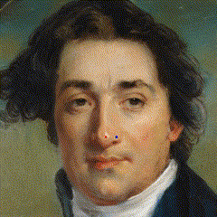

# DragGAN Implementation with ONNX Runtime Framework

This repository contains the source code and examples for implementing [DragGAN](https://vcai.mpi-inf.mpg.de/projects/DragGAN/), based on our [StyleGAN](https://github.com/NVlabs/stylegan2-ada-pytorch) implementation, using the ONNX Runtime Framework. 

StyleGAN is a Generative Adversarial Network (GAN) architecture that generates high-quality and high-resolution images. DragGAN is a new AI technique that allows users to manipulate images in seconds with just a click and drag. It uses a pre-trained StyleGAN to synthesize realistic images that follow user input. DragGAN can rotate, resize, deform, and change the direction of objects in an image.

For more details, please refer to our [blog post](https://onnxruntime.ai/blogs.html).

## Source Code

This repository includes the following components:

- A portable and lightweight PyTorch implementation of [StyleGAN 2 Ada](https://github.com/NVlabs/stylegan2-ada-pytorch).
- A Python converter for converting Nvidia's pretrained StyleGAN checkpoints, which can be found [here](https://nvlabs-fi-cdn.nvidia.com/stylegan2-ada-pytorch/pretrained/).
- An implementation of DragGAN, described in [Drag Your GAN: Interactive Point-based Manipulation on the Generative Image Manifold](https://vcai.mpi-inf.mpg.de/projects/DragGAN/) from SGIRAPH 2023.
- Examples of exporting both StyleGAN and DragGAN models to ONNX format.
- Example Python scripts demonstrating how to use the StyleGAN and DragGAN ONNX models with the ONNX Runtime Framework.
- Example C# project demonstrating how to use the StyleGAN and DragGAN ONNX models in a Win32 app.

## Dependencies

To use this repository, you will need the following dependencies:

- PyTorch
- Numpy
- OpenCV
- FFmpeg (for saving images and creating animation clips)
- Visual Studio 2022 (to run the C# application)

You can set up a virtual environment with the necessary packages using the following script:

```shell
conda create -p=./env python=3.9
conda activate ./env
conda install pytorch torchvision torchaudio pytorch-cuda=11.8 -c pytorch -c nvidia
pip install opencv-python
pip install onnxruntime-training
conda install -c conda-forge ffmpeg
```

## Converting Nvidia's Pretrained Checkpoints

To convert Nvidia's pretrained checkpoints for StyleGAN 2 Ada, follow these steps:

1. Download the weights from [Nvidia](https://nvlabs-fi-cdn.nvidia.com/stylegan2-ada-pytorch/pretrained/) and place them in the "checkpoints" folder.
2. Update the "model_name" variable in "checkpoint_converter.py" to point to the model you want to convert.
3. Run the script, and it will save the StyleGAN mapper and generator weights in PyTorch format.

## Demo Scripts

This repository provides four demo scripts:

- "stylegan_demo.py" demonstrates loading the StyleGAN weights and generating an image. You can customize the model and seed for different output images.
- "draggan_demo.py" runs the DragGAN implementation based on the StyleGAN model. It also exports StyleGAN Mapper and Generator, as well as the DragGAN model and training artifacts to ONNX format.
- "stylegan_onnx_demo.py" shows how to use the ONNX version of the StyleGAN mapper and generator.
- "draggan_onnx_demo.py" demonstrates loading the necessary ONNX models and artifacts to run the DragGAN optimization process.


<h1>Examples</h1>

Here are some examples of generated images and videos:

<table>
    <tr>
        <td>
            <p><b><i>metfaces</i></b> Dataset</p>
        <td>
    </tr>
    <tr>
        <td>
            
        </td>
        <td>
            
        </td>
    </tr>
    <tr>
        <td width="200px">
            stylegan_demo.py - seed=<b><i>71</i></b>
        </td>
        <td  width="200px">
            draggan_demo.py - seed=<b><i>71</i></b>
        </td>
    </tr>
    <tr>
        <td>
            <p><b><i>ffhq</i></b> Dataset</p>
        <td>
    </tr>
    <tr>
        <td>
            
        </td>
        <td>
            
        </td>
    </tr>
    <tr>
        <td width="200px">
            stylegan_demo.py - seed=<b><i>71</i></b>
        </td>
        <td  width="200px">
            draggan_demo.py - seed=<b><i>71</i></b>
        </td>
    </tr>
</table>


<h1>C# Application Overview</h1>

The C# solution can be found within the DragGANApp folder and is composed of three distinct projects:

1. **Cyotek.Windows.Forms.ImageBox**: This project is an integral part of the [component](https://github.com/cyotek/Cyotek.Windows.Forms.ImageBox) created by [Richard Moss](https://github.com/cyotek). It offers functionalities for image viewing, zooming, panning, and scrolling.

2. **Cyotek.Windows.Forms.ImageBox.Demo**: Similar to the Cyotek.Windows.Forms.ImageBox project, this is also a part of the component and serves as a demonstration of its capabilities.

3. **DragGANApp**: Within this project, you'll find the DragGAN class. It provides insights on how to load and employ ONNX models. Additionally, this project contains a user interface window that enables users to select an image, mark a pair of points on it, and execute an optimization process.

It's worth noting that the application relies on an Options.json file (see the example below) that holds various global parameters, including the dataset to load. The "$" symbol within the Model path will be dynamically replaced by the executable folder.

```shell
{
  "BGColor": {
    "R": 255,
    "G": 255,
    "B": 222
  },
  "InitialSeed": 50,
  "Iterations": 100,
  "Model": "$/../../../../onnx/metfaces"
}
```

To mark points on the image, simply use the right-click button on your mouse.


