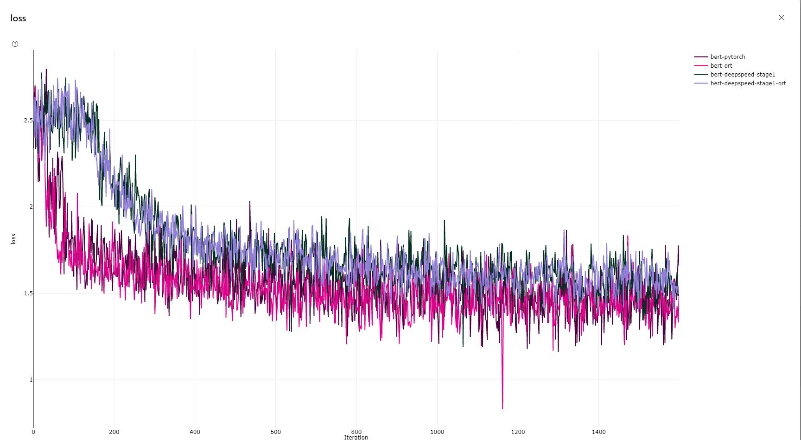

# Run Instruction
1. Follow steps in [README.md](README.md)
2. Launch script in [2.2 Run this recipe](README.md#2.2-Run-this-recipe) for BERT
If running on AzureML,
```bash
cd huggingface/azureml
python hf-ort.py --gpu_cluster_name <gpu_cluster_name> --hf_model bert-large --run_config ort
```
If running locally,
```bash
cd huggingface/azureml
python hf-ort.py --hf_model bert-large --run_config ort --process_count <process_count> --local_run True
```

# Performance Comparison
| Run configuration           | PyTorch | ORTModule | Gain  |
| -----------------           | ------- | --------- | ----- |
| fp16                        | 137.61  | 150.50    |  9.4% |
| fp16 with deepspeed stage 1 | 151.39  | 159.07    |  5.1% |

These numbers are average of samples/sec from 10 runs on [`ND40rs_v2`](https://azure.microsoft.com/en-us/pricing/details/machine-learning/) VMs (V100 32G x 8), Cuda 11, with stable release [`onnxruntime_training-1.8.0%2Bcu111-cp36-cp36m-manylinux2014_x86_64.whl`](https://onnxruntimepackages.z14.web.core.windows.net/onnxruntime_stable_cu111.html) with batch size of 8. Cuda 10.2 option is also available through `--use_cu102` flag. Please check dependency details in [Dockerfile](docker/Dockerfile). We look at the metrics `stable_train_samples_per_second` in the log, which discards first step that includes setup time. Also please note since ORTModule takes some time to do initial setup, smaller `--max_steps` value may lead to longer total run time for ORTModule compared to PyTorch. However, if you want to see finetuning to finish faster, adjust `--max_steps` to a smaller value. Lastly, we do not recommend running this recipe on [`NC`] series VMs which uses old architecture (K80).

# Convergence
