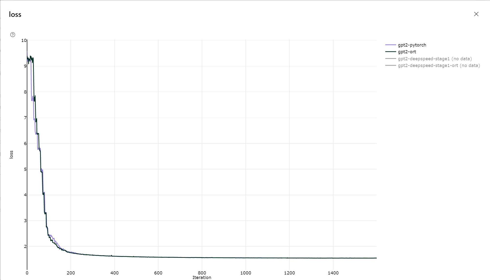

# Run Instruction
1. Follow steps in [README.md](README.md)
2. Training script in [2.2 Run this recipe](README.md#2.2-Run-this-recipe) for GPT2 is
```bash
cd huggingface/azureml
python hf-ort.py --gpu_cluster_name <gpu_cluster_name> --hf_model gpt2 --run_config ort
```

# Performance Comparison
| Run configuration           | PyTorch | ORTModule | Gain  |
| -----------------           | ------- | --------- | ----- |
| fp16                        | 131.19  | 166.60    | 27.0% |
| fp16 with deepspeed stage 1 | 182.64  | 227.00    | 51.7% |
Number reflects samples/sec on above run on ND40rs_v2 machine (V100 32G, 8 GPUs), Cuda 11, with stable release `onnxruntime_training-1.8.0%2Bcu111-cp36-cp36m-manylinux2014_x86_64.whl` published [here](https://onnxruntimepackages.z14.web.core.windows.net/onnxruntime_stable_cu111.html). Please see dependency version details in [Dockerfile](docker/Dockerfile).

# Convergence
