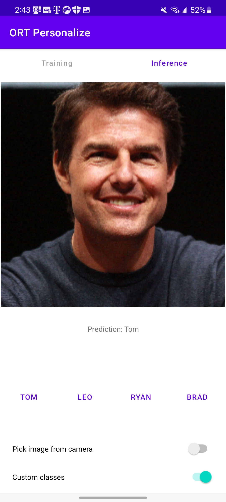
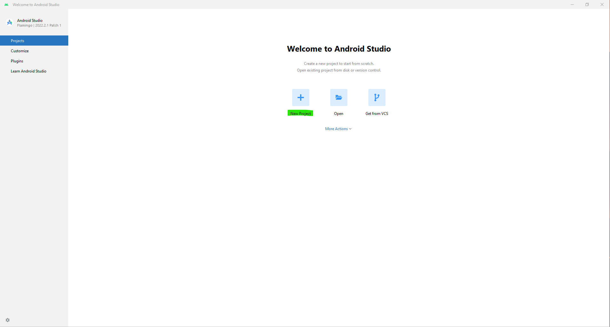
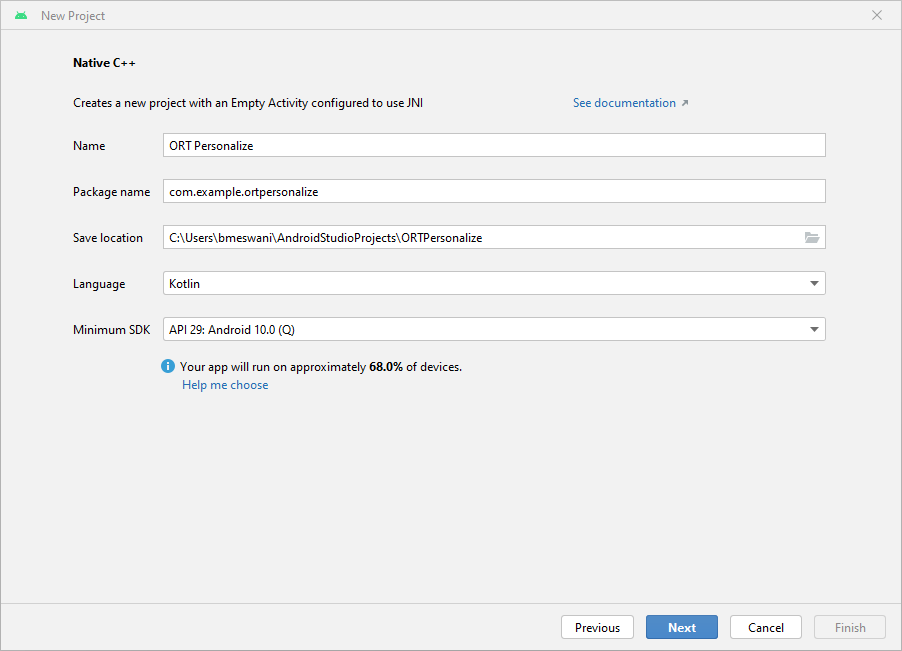
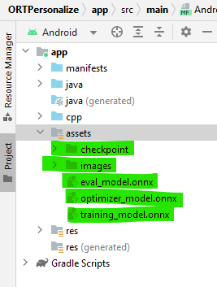
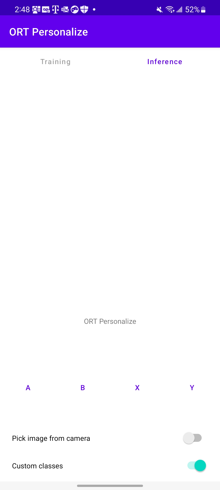
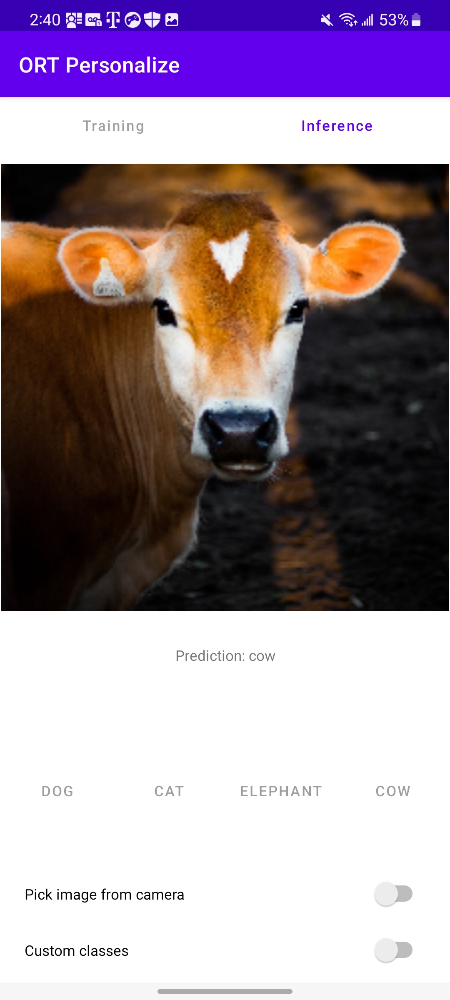

# On-Device Training: Building an Android Application

In this tutorial, we will explore how to build an Android application that incorporates ONNX Runtime's On-Device Training solution. On-device training refers to the process of training a machine learning model directly on an edge device without relying on cloud services or external servers.

Here is what the application will look like at the end of this tutorial:



## Introduction

We will guide you through the steps to create an Android app that can train a simple image classification model using on-device training techniques. This tutorial showcases the `transfer learning` technique where knowledge gained from training a model on one task is leveraged to improve the performance of a model on a different but related task. Instead of starting the learning process from scratch, transfer learning allows us to transfer the knowledge or features learned by a pre-trained model to a new task.

For this tutorial, we will leverage the `MobileNetV2` model which has been trained on large-scale image datasets such as ImageNet (which has 1,000 classes). We will use this model for classifying custom data into one of four classes. The initial layers of MobileNetV2 serve as a feature extractor, capturing generic visual features applicable to various tasks, and only the final classifier layer will be trained for the task at hand.

In this tutorial, we will use data to learn to:
- Classify animals into one of four categories using a pre-packed animals dataset.
- Classify celebrities into one of four categories using a custom celebrities dataset.

## Contents

- [Introduction](#introduction)
- [Prerequisites](#prerequisites)
- [Offline Phase - Building the training artifacts](#offline-phase---building-the-training-artifacts)
  - [Export the model to ONNX](#op1)
  - [Define the trainable and non trainable parameters](#op2)
  - [Generate the training artifacts](#op3)
- [Training Phase - Android application development](#training-phase---android-application-development)
  - [Setting up the project in Android Studio](#tp1)
  - [Adding the ONNX Runtime dependency](#tp2)
  - [Packaging the Prebuilt Training Artifacts and Dataset](#tp3)
  - [Interfacing with ONNX Runtime - Java Code](#tp4)
  - [Image Preprocessing](#tp5)
  - [Application Frontend](#tp6)
- [Training Phase - Running the application on a device](#training-phase---running-the-application-on-a-device)
  - [Running the application on a device](#tp7)
  - [Training with a pre-loaded dataset - Animals](#tp8)
  - [Training with a custom dataset - Celebrities](#tp9)
- [Conclusion](#conclusion)

## Prerequisites

To follow this tutorial, you should have a basic understanding of Android app development using Java or Kotlin. Familiarity with Java as well as familiarity with machine learning concepts such as neural networks and image classification will help as well.

- Python development environment to prepare the training artifacts
- Android Studio 4.1+
- Android SDK 32+
- An Android device with a camera in [developer mode](https://developer.android.com/studio/debug/dev-options) with USB debugging enabled

> **Note** The entire android application is also made available in [`the app/ORTPersonalize folder`](app/ORTPersonalize/).

## Offline Phase - Building the training artifacts

Relevant files in the directory for this section:

- [`prepare_for_training.ipynb`](prepare_for_training.ipynb)

1. <a name="op1"></a>Export the model to ONNX.

    We start with a pre-trained PyTorch model and export it to ONNX. The `MobileNetV2` model has been pretrained on the imagenet dataset that has data in 1000 categories. For our task of image classification, we want to only classify images in 4 classes. So, we change the last layer of the model to output 4 logits instead of 1,000.

    More details around how to export PyTorch models to ONNX can be found [here](https://pytorch.org/docs/stable/onnx.html).

    ```python
   import torch
   import torchvision

   model = torchvision.models.mobilenet_v2(
      weights=torchvision.models.MobileNet_V2_Weights.IMAGENET1K_V2)

   # The original model is trained on imagenet which has 1000 classes.
   # For our image classification scenario, we need to classify among 4 categories.
   # So we need to change the last layer of the model to have 4 outputs.
   model.classifier[1] = torch.nn.Linear(1280, 4)

   # Export the model to ONNX.
   model_name = "mobilenetv2"
   torch.onnx.export(model, torch.randn(1, 3, 224, 224),
                     f"training_artifacts/{model_name}.onnx",
                     input_names=["input"], output_names=["output"],
                     dynamic_axes={"input": {0: "batch"}, "output": {0: "batch"}})
    ```

2. <a name="op2"></a>Define the trainable and non trainable parameters

    ```python
   import onnx

   # Load the onnx model.
   onnx_model = onnx.load(f"training_artifacts/{model_name}.onnx")

   # Define the parameters that require their gradients to be computed
   # (trainable parameters) and those that do not (frozen/non trainable parameters).
   requires_grad = ["classifier.1.weight", "classifier.1.bias"]
   frozen_params = [
      param.name
      for param in onnx_model.graph.initializer
      if param.name not in requires_grad
   ]
    ```

3. <a name="op3"></a>Generate the training artifacts.

   We will use the `CrossEntropyLoss` loss and the `AdamW` optimizer for this tutorial. More details around artifact generation can be found at [On Device Training / Prepare for training](https://onnxruntime.ai/docs/api/python/on_device_training/training_artifacts.html).

    ```python
   from onnxruntime.training import artifacts

   # Generate the training artifacts.
   artifacts.generate_artifacts(
      onnx_model,
      requires_grad=requires_grad,
      frozen_params=frozen_params,
      loss=artifacts.LossType.CrossEntropyLoss,
      optimizer=artifacts.OptimType.AdamW,
      artifact_directory="training_artifacts"
   )
    ```


   That's all! The training artifacts have been generated in the `training_artifacts` folder. This marks the end of the offline phase. These artifacts are ready to be deployed to the Android device for training.

## Training Phase - Android application development

Relevant files in the directory for this section:

- [`train.ipynb`](train.ipynb)
- [`build.gradle (Module)`](app/ORTPersonalize/app/build.gradle)
- [`images.zip`](data/images.zip)
- [`ORTTrainer.kt`](app/ORTPersonalize/app/src/main/java/com/example/ortpersonalize/ORTTrainer.kt)
- [`ImageProcessingUtil.kt`](app/ORTPersonalize/app/src/main/java/com/example/ortpersonalize/ImageProcessingUtil.kt)
- [`MainActivity.kt`](app/ORTPersonalize/app/src/main/java/com/example/ortpersonalize/MainActivity.kt)
- [`Layouts`](app/ORTPersonalize/app/src/main/res/layout/)
- [`AndroidManifest.xml`](app/ORTPersonalize/app/src/main/AndroidManifest.xml)

1. <a name="tp1"></a>Setting up the project in Android Studio

   a. Open Android Studio and click `New Project`
   

   b. Click on `Empty Activity` -> `Next`. Fill out the `New Project` details as follows:

     - Name - `ORTPersonalize`
     - Package Name - `com.example.ortpersonalize`
     - Language - `Kotlin`

      Click `Next`.

   

   d. That's it! The Android Studio project has been set up. You should now be able to see the Android Studio editor with some boiler plate code.

2. <a name="tp2"></a>Adding the ONNX Runtime dependency

   a. In `build.gradle (Module)`, add the dependency to the `dependencies` block:

   ```
      implementation 'com.microsoft.onnxruntime:onnxruntime-training-android:latest.release'  // full package
   ```

   b. In `build.gradle (Module)`, add the `buildFeatures` block to the `android` block:

   ```
      buildFeatures {
         viewBinding true
      }
   ```

   j. Build the application and wait for success to confirm that the app has included the ONNX Runtime package.

3. <a name="tp3"></a>Packaging the Prebuilt Training Artifacts and Dataset

   a. Create a new `assets` folder inside the `app` from the left pane of the Android Studio project by right click app -> New -> Folder -> Assets Folder and place it under main.

   b. Copy the training artifacts generated in step 2 to this folder.

   c. Now, head over to the [`onnxruntime-training-examples`](https://github.com/microsoft/onnxruntime-training-examples/tree/master/on_device_training/mobile/android/c-cpp/data) repo and download the dataset (`images.zip`) to your machine and extract it. This dataset was modified from the orignal [`animals-10`](https://www.kaggle.com/datasets/alessiocorrado99/animals10) dataset available on Kaggle created by [Corrado Alessio](https://www.kaggle.com/alessiocorrado99).

   d. Copy the downloaded `images` folder to `assets/images` directory in Android Studio.

   The left pane of the project should look like this:

   

4. <a name="tp4"></a>Interfacing with ONNX Runtime - Java Code

   a. We will implement the following two methods in the Kotlin class `ORTTrainer.kt` that will be called from the application:
      - `performTraining`: Will be invoked when the user clicks the `Train` button on the UI.
      - `performInference`: Will be invoked when the user clicks the `Infer` button on the UI.

   b. Constructing the ORTTrainer

      The ORTTrainer gets constructed when the application is launched. This will use the training artifacts assets to create the `OrtTrainingSession`. This object will be used for training on the device

      The arguments to `ORTTrainer` constructor are:
      - `checkpoint_path`: Cached path to the checkpoint artifact.
      - `train_model_path`: Cached path to the training model artifact.
      - `eval_model_path`: Cached path to the eval model artifact.
      - `optimizer_model_path`: Cached path to the optimizer model artifact.

   ```java
      constructor(checkpointPath: String, trainModelPath: String, evalModelPath: String, optimizerModelPath: String) {
         ortEnv = OrtEnvironment.getEnvironment()
         ortTrainingSession = ortEnv?.createTrainingSession(checkpointPath, trainModelPath, evalModelPath, optimizerModelPath)
      }
   ```

   c. Perform Training

      This function gets called for every batch that needs to be trained. The training loop is written on the application side in Kotlin, and within the training loop, the `performTraining` function gets invoked for every batch.

      The arguments to `performTraining` are:
      - `data`: Input images as a float array to be passed in for training.
      - `labels`: Labels as an int array associated with the input images provided for training.
      - `batch_size`: Number of images to process with each `TrainStep`.

      The function returns performs training on the given images.

   ```java
      public fun performTraining(data: FloatBuffer, labels: IntBuffer, batchSize: Long) {
         ortSession = null

         var loss = -1.0f
         ortEnv.use {
            val dataShape = longArrayOf(batchSize, 3, 224, 224)
            val inputTensor = OnnxTensor.createTensor(ortEnv, data, dataShape)
            val labelsShape = longArrayOf(batchSize)
            val labelsTensor = OnnxTensor.createTensor(ortEnv, labels, labelsShape)
            inputTensor.use {
                  labelsTensor.use {
                     val ortInputMap: MutableMap<String, OnnxTensor> = HashMap<String, OnnxTensor>()
                     ortInputMap["input"] = inputTensor
                     ortInputMap["labels"] = labelsTensor
                     val output = ortTrainingSession?.trainStep(ortInputMap)
                     output.use {
                        @Suppress("UNCHECKED_CAST")
                        loss = ((output?.get(0)?.value) as Float)
                     }
                  }
            }

            ortTrainingSession?.optimizerStep()
            ortTrainingSession?.lazyResetGrad()
         }
      }
   ```

   e. Perform Inference

      This function gets called when the user wants to perform inferencing.

      The arguments to `performInference` are:
      - `imgData`: Input images as a float array to be passed in for training.
      - `classes`: List of strings representing all the four custom classes.
      - `cacheDir`: Directory to where the inference onnx model must be exported to.

      The function returns a `string` that represents one of the four custom classes provided. This is the prediction of the model.

   ```java
      public fun performInference(imgData: FloatBuffer, classes: Array<String>, cacheDir: File): String {
         if (ortSession == null) {
               val inferenceModelPath: Path = Paths.get(cacheDir.toString(), "inference_model.onnx")
               val graphOutput: Array<String> = arrayOf("output")
               ortTrainingSession?.exportModelForInference(inferenceModelPath, graphOutput)
               ortSession = ortEnv?.createSession(inferenceModelPath.toString())
         }
         var maxIdx = -1
         ortEnv.use {
               val shape = longArrayOf(1, 3, 224, 224)
               val tensor = OnnxTensor.createTensor(ortEnv, imgData, shape)
               tensor.use {
                  val output = ortSession?.run(Collections.singletonMap("input", tensor))
                  output.use {
                     @Suppress("UNCHECKED_CAST")
                     val rawOutput = ((output?.get(0)?.value) as Array<FloatArray>)[0]
                     val probabilities = softMax(rawOutput)

                     maxIdx = probabilities.indices.maxBy { probabilities[it] } ?: -1
                  }
               }
         }

         check(maxIdx >= 0) { "Index is < 0" }

         return classes[maxIdx]
      }

      private fun softMax(modelResult: FloatArray): FloatArray {
         val labelVals = modelResult.copyOf()
         val max = labelVals.max()
         var sum = 0.0f

         // Get the reduced sum
         for (i in labelVals.indices) {
               labelVals[i] = exp(labelVals[i] - max)
               sum += labelVals[i]
         }

         if (sum != 0.0f) {
               for (i in labelVals.indices) {
                  labelVals[i] /= sum
               }
         }

         return labelVals
      }
   ```

5. <a name="tp5"></a>Image Preprocessing

   a. The `MobileNetV2` model expects that the input image provided be
      - of size `3 x 224 x 224`.
      - a normalized image with the mean `(0.485, 0.456, 0.406)` subtracted and divided by the standard deviation `(0.229, 0.224, 0.225)`

      This preprocessing is done in Java/Kotlin using the android provided libraries.

      Let's create a new file called `ImageProcessingUtil.kt` under the `app/src/main/java/com/example/ortpersonalize` directory. We will add the utility methods for cropping and resizing, and normalizing the images in this file.

   b. Cropping and resizing the image.

   ```java
   fun processBitmap(bitmap: Bitmap) : Bitmap {
      // This function processes the given bitmap by
      //   - cropping along the longer dimension to get a square bitmap
      //     If the width is larger than the height
      //     ___+_________________+___
      //     |  +                 +  |
      //     |  +                 +  |
      //     |  +        +        +  |
      //     |  +                 +  |
      //     |__+_________________+__|
      //     <-------- width -------->
      //        <----- height ---->
      //     <-->      cropped    <-->
      //
      //     If the height is larger than the width
      //     _________________________   ʌ            ʌ
      //     |                       |   |         cropped
      //     |+++++++++++++++++++++++|   |      ʌ     v
      //     |                       |   |      |
      //     |                       |   |      |
      //     |           +           | height width
      //     |                       |   |      |
      //     |                       |   |      |
      //     |+++++++++++++++++++++++|   |      v     ʌ
      //     |                       |   |         cropped
      //     |_______________________|   v            v
      //
      //
      //
      //   - resizing the cropped square image to be of size (3 x 224 x 224) as needed by the
      //     mobilenetv2 model.
      lateinit var bitmapCropped: Bitmap
      if (bitmap.getWidth() >= bitmap.getHeight()) {
         // Since height is smaller than the width, we crop a square whose length is the height
         // So cropping happens along the width dimesion
         val width: Int = bitmap.getHeight()
         val height: Int = bitmap.getHeight()

         // left side of the cropped image must begin at (bitmap.getWidth() / 2 - bitmap.getHeight() / 2)
         // so that the cropped width contains equal portion of the width on either side of center
         // top side of the cropped image must begin at 0 since we are not cropping along the height
         // dimension
         val x: Int = bitmap.getWidth() / 2 - bitmap.getHeight() / 2
         val y: Int = 0
         bitmapCropped = Bitmap.createBitmap(bitmap, x, y, width, height)
      } else {
         // Since width is smaller than the height, we crop a square whose length is the width
         // So cropping happens along the height dimesion
         val width: Int = bitmap.getWidth()
         val height: Int = bitmap.getWidth()

         // left side of the cropped image must begin at 0 since we are not cropping along the width
         // dimension
         // top side of the cropped image must begin at (bitmap.getHeight() / 2 - bitmap.getWidth() / 2)
         // so that the cropped height contains equal portion of the height on either side of center
         val x: Int = 0
         val y: Int = bitmap.getHeight() / 2 - bitmap.getWidth() / 2
         bitmapCropped = Bitmap.createBitmap(bitmap, x, y, width, height)
      }

      // Resize the image to be channels x width x height as needed by the mobilenetv2 model
      val width: Int = 224
      val height: Int = 224
      val bitmapResized: Bitmap = Bitmap.createScaledBitmap(bitmapCropped, width, height, false)

      return bitmapResized
   }
   ```

   c. Normalizing the image.

   ```java
   fun processImage(bitmap: Bitmap, buffer: FloatBuffer, offset: Int) {
      // This function iterates over the image and performs the following
      // on the image pixels
      //   - normalizes the pixel values to be between 0 and 1
      //   - substracts the mean (0.485, 0.456, 0.406) (derived from the mobilenetv2 model configuration)
      //     from the pixel values
      //   - divides by pixel values by the standard deviation (0.229, 0.224, 0.225) (derived from the
      //     mobilenetv2 model configuration)
      // Values are written to the given buffer starting at the provided offset.
      // Values are written as follows
      // |____|____________________|__________________| <--- buffer
      //      ʌ                                         <--- offset
      //                           ʌ                    <--- offset + width * height * channels
      // |____|rrrrrr|_____________|__________________| <--- red channel read in column major order
      // |____|______|gggggg|______|__________________| <--- green channel read in column major order
      // |____|______|______|bbbbbb|__________________| <--- blue channel read in column major order

      val width: Int = bitmap.getWidth()
      val height: Int = bitmap.getHeight()
      val stride: Int = width * height

      for (x in 0 until width) {
         for (y in 0 until height) {
               val color: Int = bitmap.getPixel(y, x)
               val index = offset + (x * height + y)

               // Subtract the mean and divide by the standard deviation
               // Values for mean and standard deviation used for
               // the movilenetv2 model.
               buffer.put(index + stride * 0, ((Color.red(color).toFloat() / 255f) - 0.485f) / 0.229f)
               buffer.put(index + stride * 1, ((Color.green(color).toFloat() / 255f) - 0.456f) / 0.224f)
               buffer.put(index + stride * 2, ((Color.blue(color).toFloat() / 255f) - 0.406f) / 0.225f)
         }
      }
   }
   ```

      d. Getting a Bitmap from a Uri

   ```java
   fun bitmapFromUri(uri: Uri, contentResolver: ContentResolver): Bitmap {
      // This function reads the image file at the given uri and decodes it to a bitmap
      val source: ImageDecoder.Source = ImageDecoder.createSource(contentResolver, uri)
      return ImageDecoder.decodeBitmap(source).copy(Bitmap.Config.ARGB_8888, true)
   }
   ```

6. <a name="tp6"></a>Application Frontend

   a. For this tutorial, we will be using the following user interface elements:
     - Train and Infer buttons
     - Class buttons
     - Status message text
     - Image display
     - Progress dialogue

   b. This tutorial does not intend to show how the graphical user interface is created. For this reason, we will simply re-use the files available on [GitHub](https://github.com/microsoft/onnxruntime-training-examples/).

   c. Copy all the string definitions from [`strings.xml`](https://github.com/microsoft/onnxruntime-training-examples/blob/206521eb22e496b2ea50bef956e63273b6b1d5bf/on_device_training/mobile/android/c-cpp/app/ORTPersonalize/app/src/main/res/values/strings.xml) to `strings.xml` local to your Android Studio.

   d. Copy the contents from [`activity_main.xml`](https://github.com/microsoft/onnxruntime-training-examples/blob/206521eb22e496b2ea50bef956e63273b6b1d5bf/on_device_training/mobile/android/c-cpp/app/ORTPersonalize/app/src/main/res/layout/activity_main.xml) to `activity_main.xml` local to your Android Studio.

   e. Create a new file under the `layout` folder called `dialog.xml`. Copy the contents from [`dialog.xml`](https://github.com/microsoft/onnxruntime-training-examples/blob/206521eb22e496b2ea50bef956e63273b6b1d5bf/on_device_training/mobile/android/c-cpp/app/ORTPersonalize/app/src/main/res/layout/dialog.xml) to the newly created `dialog.xml` local to your Android Studio.

   f. The remainder of the changes in this section need to be made in the [MainActivity.kt](https://github.com/microsoft/onnxruntime-training-examples/blob/master/on_device_training/mobile/android/c-cpp/app/ORTPersonalize/app/src/main/java/com/example/ortpersonalize/MainActivity.kt) file.

   g. Launching the application

      When the application launches, the `onCreate` function gets invoked. This function is responsible for setting up the session cache and the user interface handlers.

      Please refer to the `onCreate` function in the `MainActivity.kt` file for the code.

   h. Custom class button handlers - We would like to use the class buttons for users to select their custom images for training. We need to add the listeners for these buttons to do this. These listeners will do exactly that.

      Please refer to these button handlers in `MainActivity.kt`:

      - onClassAClickedListener
      - onClassBClickedListener
      - onClassXClickedListener
      - onClassYClickedListener

   i. Personalize the custom class labels

      By default, the custom class labels are `[A, B, X, Y]`. But, let's allow users to rename these labels for clarity. This is achieved by long click listeners namely (defined in `MainActivity.kt`):

      - onClassALongClickedListener
      - onClassBLongClickedListener
      - onClassXLongClickedListener
      - onClassYLongClickedListener

   j. Toggling the custom classes.

      When the custom class toggle is turned off, the prepackaged animals dataset is run. And when it is turned on, the user is expected to bring their own dataset for training. To handle this transition, the `onCustomClassSettingChangedListener` switch handler is implemented in `MainActivity.kt`.

   k. Training handler
   
      When each class has at least 1 image, the `Train` button can be enabled. When the `Train` button is clicked, training kicks in for the selected images. The training handler is responsible for:
      - collecting the training images into one container.
      - shuffling the order of the images.
      - cropping and resizing the images.
      - normalizing the images.
      - batching the images.
      - executing the training loop (invoking the `ORTTrainer` `performTraining` function in a loop).

      The `onTrainButtonClickedListener` function defined in `MainActivity.kt` does the above.

   l. Inference handler

      Once training is complete, the user can click the `Infer` button to infer any image. The inference handler is responsible for
      - collecting the inference image.
      - cropping and resizing the image.
      - normalizing the image.
      - invoking the `ORTTrainer` `performInference` function.
      - Reporting the inferred output to the user interface.

      This is achieved by the `onInferenceButtonClickedListener` function in `MainActivity.kt`.

   m. Handler for all the activities mentioned above

      Once the image(s) have been selected for inference or for the custom classes, they need to be processed. The `onActivityResult` function defined in `MainActivity.kt` does that.

   n. One last thing. Add the following in the `AndroidManifest.xml` file to use the camera:

   ```xml
   <uses-permission android:name="android.permission.CAMERA" />
   <uses-feature android:name="android.hardware.camera" />
   ```

## Training Phase - Running the application on a device

1. <a name="tp7"></a>Running the application on a device

   a. Let's connect our Android device to the machine and run the application on the device.

   b. Launching the application on the device should look like this:

   

2. <a name="tp8"></a>Training with a pre-loaded dataset - Animals

   a. Let's get started with training using the pre-loaded animals device by launching the application on the device.

   b. Toggle the `Custom classes` switch at the bottom.

   c. The class labels will change to `Dog`, `Cat`, `Elephant` and `Cow`.

   d. Run `Training` and wait for the progress dialog to disappear (upon training completion).

   e. Use any animal image from your library for inferencing now.

   

   As can be seen from the image above, the model correctly predicted `Cow`.

3. <a name="tp9"></a>Training with a custom dataset - Celebrities

   a. Download images of Tom Cruise, Leonardo DiCaprio, Ryan Reynolds and Brad Pitt from the web.
   
   b. Make sure you launch a fresh session of the app by closing the app and relaunching it.

   c. After the application launches, rename the four classes to `Tom`, `Leo`, `Ryan`, `Brad` respectively using the long click.

   d. Click on the button for each class and select images associated with that celebrity. We can use around 10~15 images per category.

   e. Hit the `Train` button and let the application learn from the data provided.

   f. Once the training is complete, we can hit the `Infer` button and provide an image that the application has not seen yet.

   g. That's it!. Hopefully the application classified the image correctly.

   


## Conclusion

Congratulations! You have successfully built an Android application that learns to classify images using ONNX Runtime on the device.