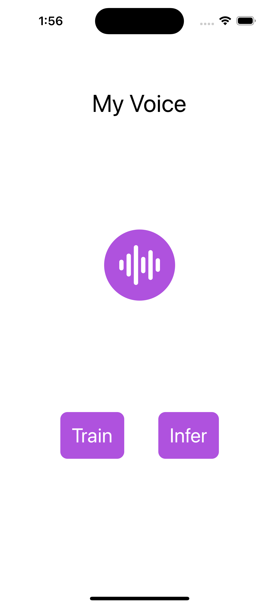

# MyVoice
MyVoice uses onnxruntime iOS on device training APIs to perform voice verification on client without transmitting any user voice data.

The application uses the user audio recordings and sample audio recordings from [librispeech](https://huggingface.co/datasets/librispeech_asr) dataset to train the model to identify user voice. 

## Training Your Voice

1. Launch the app and click on the "Train" button on the home screen to access the training section.

2. In the training session, you will be presented with a sample sentence along with a "Record" button. Simply press the "Record" button and speak the displayed sentence, or you may choose to record any other sentence of your choice.

3. The app will continue to present new sentences for to record until the training process is complete. 

Once the training is finished, the app will display an "Infer" button, which will lead you to the infer screen.

## Verifying Your Voice
Head to the infer screen to perform inference on the trained model. Click on the "Record" button to record any audio and the app will display the confidence score of the model in identifying the speaker as the user.




## Model information

MyVoice uses [wav2vec model](https://huggingface.co/superb/wav2vec2-base-superb-sid) trained on VoiceCeleb database and applies transfer learning principles to create a model that can confidently identify user voice from 1 minute of user audio.

## Set up
To build and run the example, you'll need to install pods, generate artifacts and download sample recordings.

### Install the Pod dependencies

From this directory, run:

```bash
pod install
```

### Generate Artifacts
[Artifacts generation](./artifacts_gen.py) script downloads the model from huggingface and creates the folder named `artifacts` containing training artifacts. 

From this directory, run:

```bash
python artifacts_gen.py
```

The script should generates the required training artifacts. Put this artifacts inside the `MyVoice/artifacts` directory.


### Download Sample Recordings
To download sample recordings from dataset, run [Recording generation](./recording_gen.py) script. The script downloads recordings sample in `MyVoice/recordings` directory. 

From this directory, run:

```bash
python recording_gen.py
```

## Build and run

Open the generated MyVoice.xcworkspace file in Xcode to build and run the example.